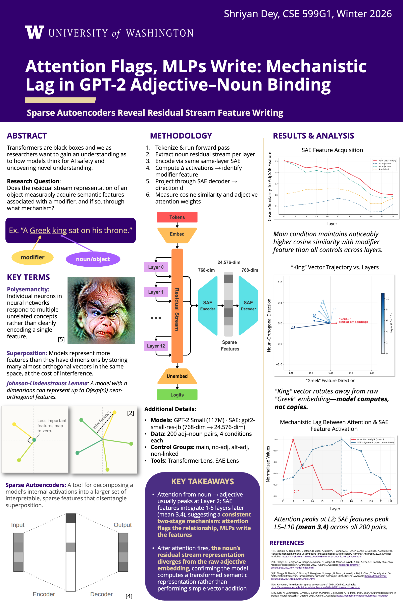

# Attention Flags, MLPs Write: Mechanistic Lag in GPT-2 Adjective–Noun Binding

**Sparse Autoencoders Reveal Residual Stream Feature Writing**

Shriyan Dey · CSE 599G1 (Interpretability), Winter 2026 · University of Washington

---

## TL;DR

When GPT-2 reads *"A Greek king sat on his throne,"* does the residual stream at the *king* token measurably acquire *Greek*-associated features — and through what mechanism?

**Finding:** Attention identifies the adjective–noun relationship at **Layer 2**, but adjective-specific SAE features don't appear in the noun's residual stream until **~3.4 layers later** (typical range 1–5). Attention *flags* the relationship; MLPs *write* the features. The pattern replicates across **179/200 (90%)** adjective–noun pairs.


---



📄 [Full poster (PDF)](CSE599G1Poster.pdf)

---

## Research Question

Does the residual stream representation of an object measurably acquire semantic features associated with a modifier, and if so, through what mechanism?

## Method

For each adjective–noun pair, across four control conditions:

1. Tokenize and run a forward pass through GPT-2 Small
2. Extract the noun's residual stream at every layer
3. Encode each layer's residual stream through the matching same-layer SAE
4. Compute Δ activations (main vs. no-adjective) to identify the modifier feature
5. Project through the SAE decoder to get the feature direction **d**
6. Measure cosine similarity to **d** and the noun → adjective attention weight per layer

**Control conditions:** `main` (adjective modifies noun), `no_adj` (adjective removed), `alt_adj` (unrelated adjective), `non_linked` (adjective present but not modifying the noun).

## Setup

| | |
|---|---|
| Model | GPT-2 Small (117M, 12 layers, d_model=768) |
| SAE | `gpt2-small-res-jb` (768 → 24,576 dim) |
| Dataset | 200 adjective–noun pairs, tokenizer-validated single-token nouns |
| Categories | nationality, colour, size, material, emotional |
| Tools | [TransformerLens](https://github.com/TransformerLensOrg/TransformerLens), [SAE Lens](https://github.com/jbloomAus/SAELens) |

SAEs are the pretrained [`gpt2-small-res-jb`](https://huggingface.co/jbloom/GPT2-Small-SAEs-Reformatted) residual-stream autoencoders (one per layer), loaded automatically via SAE Lens.

## Key Results

- **Mechanistic lag.** Attention from noun → adjective peaks at **Layer 2**; SAE features integrate **~3.4 layers later** (typical 1–5, full range 1–10). 186/200 pairs (93%) show a positive lag — a consistent two-stage mechanism: *attention flags, MLPs write.*
- **Condition separation.** The `main` condition accumulates modifier features that the controls don't: 179/200 pairs (90%) show positive separation (main > controls). The effect is small in magnitude but highly consistent in direction.
- **The model computes, it doesn't copy.** After attention fires, the noun's residual stream moves *away* from the raw adjective embedding (cosine +0.15 → −0.08 across layers), confirming a transformed semantic representation rather than simple vector addition.

## Key Terms

- **Polysemanticity** — individual neurons respond to multiple unrelated concepts rather than cleanly encoding one feature.
- **Superposition** — models represent more features than they have dimensions by storing near-orthogonal vectors in shared space, at the cost of interference.
- **Sparse Autoencoders (SAEs)** — decompose internal activations into a larger set of interpretable, sparse features that disentangle superposition.

## Running It

Install dependencies (or run the first notebook cell, which does this for you):

```bash
pip install -r requirements.txt
```

Then open `demo.ipynb` in Google Colab (GPU runtime recommended):

1. Run the install cell, then **Runtime → Restart runtime**
2. Run every cell from the imports onward
3. Single-example plots (Experiments 2–4 on *"A Greek king…"*) render inline
4. The 200-pair sweep populates the generalisation figures and prints a consolidated **Poster-Ready Summary** at the end

To test any adjective–noun pair, edit `SENTENCES` in Section 3 and re-run.

## Note on Reproducibility

The 200-pair dataset in this notebook is a regenerated stimulus set across the same five categories as the original study; a tokenizer-validation step keeps exactly 200 single-token-noun pairs. Reported figures (mean lag 3.4, 90% separation) come from this reproduction run. The mechanism — attention at L2, feature integration a few layers later — replicates robustly.

## Citation

If you reference this work:

```bibtex
@misc{dey2026attentionflags,
  title  = {Attention Flags, MLPs Write: Mechanistic Lag in GPT-2 Adjective-Noun Binding},
  author = {Dey, Shriyan},
  year   = {2026},
  note   = {CSE 599G1, University of Washington},
  howpublished = {\url{https://github.com/shriyandey/attention-flags-mlps-write}}
}
```

## License

Released under the [MIT License](LICENSE).

## References

1. Bricken et al. "Towards Monosemanticity." Anthropic, 2023.
2. Elhage et al. "Toy Models of Superposition." Anthropic, 2022.
3. Elhage et al. "A Mathematical Framework for Transformer Circuits." Anthropic, 2021.
4. Karvonen. "Intuitions for Sparse Autoencoders." 2024.
5. Goh et al. "Multimodal Neurons in Artificial Neural Networks." OpenAI, 2021.
